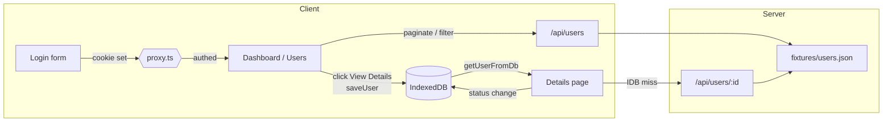

# Lendsqr Frontend Engineering Assessment

A take-home build of the Lendsqr admin console covering Login, Dashboard, Users list, and User Details. Implemented in **Next.js 16 + TypeScript + SCSS** against the [Figma design](https://www.figma.com/file/ZKILoCoIoy1IESdBpq3GNC/Frontend-Testing).

> **Live URL:** [jack-knoell-lendsqr-fe-test.vercel.app](https://jack-knoell-lendsqr-fe-test.vercel.app)
> **Source:** [github.com/knoelljack/jack-knoell-lendsqr-fe-test](https://github.com/knoelljack/jack-knoell-lendsqr-fe-test)
>
> Log in with any well-formed email + 6+ character password to enter the dashboard.

---

## Tech stack

| Layer            | Choice                                                    | Why                                                                                    |
| ---------------- | --------------------------------------------------------- | -------------------------------------------------------------------------------------- |
| Framework        | Next.js 16 (App Router) on React 19                       | Required React stack; App Router gives clean per-route boundaries (layout, loading, error, not-found). |
| Language         | TypeScript (strict)                                       | Required by the brief.                                                                 |
| Styling          | SCSS modules + design tokens mirrored as CSS custom properties | Required by the brief; modules give scoped class names and BEM-flavoured composition.  |
| Forms            | `react-hook-form`                                         | Lightweight uncontrolled form pattern; pairs cleanly with the Input primitive.         |
| Local DB         | `idb` wrapper + in-memory fallback                        | Required by the brief; Safari private mode kills IDB, so the wrapper falls back transparently. |
| Mock data        | `@faker-js/faker` (seed = 42) + `tsx`                     | Deterministic 500-record fixture; same dataset on every machine.                       |
| Testing          | Jest 30 + React Testing Library + `fake-indexeddb`        | Standard Jest stack with an IDB polyfill so the wrapper exercises its real code path.  |
| Deploy           | Vercel                                                    | Zero-config Next.js deploys.                                                           |

---

## Features

### Required by the brief

- **Login** — split-screen Lendsqr layout, form validation (email format + min password length) via `react-hook-form`, sets a `lendsqr_auth` cookie and pushes to `/dashboard`.
- **Dashboard** — minimal landing page; redirects post-login traffic toward the Users surface.
- **Users page** — paginated table of 500 records pulled from `/api/users`, four stat cards, status badges, column-header filter funnels, kebab actions.
- **User Details** — full profile rendered from IndexedDB first (instant on refresh), API fallback on miss, Blacklist / Activate actions that persist back to IDB.
- **Mobile responsive** — sidebar collapses to an off-canvas drawer behind a hamburger; topbar trims to logo + avatar at small widths; tables scroll horizontally inside their card.

### Bonus polish

- **Filter popover** triggered by the funnel icon next to each column header (organization, username, email, date, phone, status), with Reset + Filter buttons.
- **Pagination** with per-page selector (10 / 25 / 50 / 100) and a numeric pager that always shows first 2 / current ± 1 / last 2 with smart ellipsis.
- **Status actions** disable themselves when the user is already in that state.
- **Skeleton loaders** for both the users table and the details page (respect `prefers-reduced-motion`).
- **Error boundary** at `/users` and a branded 404 at `/users/[id]/not-found`.
- **Route protection** via Next 16's `proxy.ts` (formerly `middleware`); reads the auth cookie server-side so there's no protected-UI flash.

---

## Architecture



The key architectural claim is **IDB-first hydration on the details page**: clicking _View Details_ on the list writes the full user record to IndexedDB before navigation. The details page reads IDB before the API, so a hard refresh on `/users/[id]` renders instantly without round-tripping the server. The IDB wrapper falls back to an in-memory `Map` when IndexedDB is unavailable (Safari private mode, quota exceeded).

---

## Folder structure

```
src/
├── app/
│   ├── (auth)/login/              # Login route group
│   ├── (dashboard)/               # Auth-gated route group
│   │   ├── dashboard/             # /dashboard placeholder
│   │   └── users/                 # /users
│   │       ├── [id]/              # /users/[id] (details + not-found)
│   │       ├── error.tsx          # error boundary
│   │       └── UsersView.tsx      # client view (pagination, filter, kebab)
│   ├── api/users/                 # /api/users + /api/users/[id]
│   ├── layout.tsx                 # root: fonts, metadata
│   ├── not-found.tsx              # root 404
│   └── page.tsx                   # / -> /login redirect
├── components/
│   ├── brand/Logo/                # inline-SVG wordmark
│   ├── layout/                    # Sidebar, Topbar, DashboardShell
│   ├── ui/                        # Button, Input, PasswordInput, Icon,
│   │                              # Skeleton, EmptyState
│   └── users/                     # StatCard, StatusBadge, UsersTable,
│                                  # Pagination, FilterPanel,
│                                  # RowActionsMenu, UserDetailsHeader,
│                                  # UserSummaryCard, GeneralDetailsPanel
├── constants/auth.ts              # cookie name, max-age, route paths
├── lib/
│   ├── api/users.ts               # typed fetch wrappers + ApiError
│   ├── db/indexedDB.ts            # IDB wrapper with in-memory fallback
│   └── server/                    # server-only (fixture loader + stats)
├── proxy.ts                       # cookie-based route protection
├── styles/                        # tokens, mixins, typography, globals
├── test-utils/fakeUser.ts         # makeFakeUser() for tests
├── types/user.ts                  # User + nested types
└── __tests__/                     # cross-component integration tests
```

Components are co-located with their `.module.scss` and `.test.tsx`.

---

## Getting started

```bash
# clone & install
git clone https://github.com/knoelljack/jack-knoell-lendsqr-fe-test.git
cd jack-knoell-lendsqr-fe-test
npm install

# regenerate the 500-record fixture (optional; the file is committed)
npm run seed:users

# dev server (http://localhost:3000)
npm run dev

# tests
npm test                # all tests
npm run test:watch      # watch mode
npm run test:ci         # CI mode with coverage threshold

# production build
npm run build
npm start
```

### Environment variables

The project runs zero-config out of the box. The only env var is the Vercel deployment URL, which is set by Vercel automatically. A `.env.example` is committed for reference.

---

## Testing strategy

61 tests across 15 suites, each with at least one **positive** and one **negative** scenario where applicable.

| Surface                | What's covered                                                                                  |
| ---------------------- | ----------------------------------------------------------------------------------------------- |
| **LoginForm**          | Valid submit redirects, password toggle; empty/invalid/short-password blocks submit.            |
| **Sidebar**            | `aria-current` on exact match and nested route; no item active on unrelated path.               |
| **DashboardShell**     | Hamburger opens drawer, backdrop / Escape close; backdrop absent until opened.                  |
| **StatusBadge**        | Each of four known statuses maps to a `data-variant`; unknown status falls back to neutral.    |
| **UsersTable**         | Renders rows, filter funnels conditional on `onFilterClick`; empty state copy when list empty. |
| **Pagination**         | Numeric click, `aria-current`, per-page change; prev/next disabled at edges; clamp out-of-range. |
| **FilterPanel**        | Apply with populated values + initial hydration; drop empty fields; Reset clears + calls onReset. |
| **RowActionsMenu**     | Open on click, Escape close, Blacklist calls handler; Blacklist disabled when status is Blacklisted; same for Activate. |
| **API client**         | Success returns typed data, query string serialization, drops empty values; ApiError 404 + 5xx. |
| **IndexedDB wrapper**  | Round-trip, update status; missing key → undefined; in-memory fallback when IDB unavailable.   |
| **UserDetailsView**    | Hydrate from IDB without API call; API fallback; status persisted; 404 triggers notFound; 5xx renders inline error. |
| **Integration**        | View Details click → IDB → next render hydrates without API; status change persists across renders. |

Coverage thresholds: **85% statements / 80% branches / 80% functions / 85% lines** (enforced by `npm run test:ci`). Route-level files (`page.tsx`, `layout.tsx`, etc.) and server-only modules are excluded from collection because they cannot run in jsdom.

---

## Design decisions

### Why IndexedDB and not localStorage

The brief allowed either. IDB was chosen because the User record is a deeply nested object (account + personalInformation + educationAndEmployment + socials + guarantors[]), and serialising / deserialising it through `JSON.stringify` on every status update is needless work. IDB stores structured data natively. The wrapper also feature-detects IDB and falls back to an in-memory `Map` so Safari private mode doesn't break the details page.

### Why proxy.ts (cookie) and not localStorage gating

Next 16 renamed `middleware.ts` → `proxy.ts` and pinned it to the Node runtime. Reading the auth state server-side _before_ render means unauthenticated users never see a protected-UI flash. localStorage isn't visible to the proxy, so the cookie is the right transport even for a demo auth flow.

### Why a local API route and not a hosted mocky.io URL

The brief mentions mocky.io as a tool. Hosting the fixture there would mean a static payload (no real pagination), an external dependency that can go down during grading, and a slower local dev loop. The local Next.js route handler reads a committed `fixtures/users.json` and supports `?page`, `?perPage`, `?status`, `?organization`, `?username`, `?email`, `?phoneNumber`, `?dateJoined`, `?q` — the same shape a real API would expose, with zero external dependency.

### Why a portal for the kebab menu

The Users table wraps in `overflow-x: auto` for horizontal scroll on small screens. CSS specifies that when `overflow-x` is non-`visible`, the orthogonal axis also clips, so the dropdown was being cut off at the table card's edge. The kebab menu is now portaled to `document.body` with absolute coordinates computed from the trigger's `getBoundingClientRect`, recalculated on scroll/resize while open.

### Why `justify-content: space-between` on the tabs

Matches the Figma where the six tabs distribute across the full width of the summary card rather than left-clustering with a fixed gap.

---

## Known limitations

- **Status changes don't propagate back to the Users list.** When you blacklist a user on the details page, the list still shows the fixture's status. A production build would either mutate a real DB or have the Users list also consult IDB overrides on mount. Listed here so reviewers don't think it's a bug.
- **`/login`, `/dashboard`, page-level `error.tsx`, server-only modules, and the API route handlers** are not unit tested — they're exercised by integration tests where possible and excluded from coverage thresholds.
- **No internationalisation.** The brief is single-locale (en-NG); copy and currency formatting are hard-coded.
- **`/forgot-password` resolves to 404.** The link is rendered to match the Figma but the route is out of scope.

---

## Deployment

Deployed on **Vercel** with zero configuration. The repo's `main` branch builds and deploys automatically.

```bash
# manual deploy (requires vercel CLI logged in)
vercel --prod
```

---

## Commit history

History is intentionally a per-phase narrative, merged with `--no-ff` so the phase boundaries stay visible in `git log --graph`:

| Branch                 | Phase                                                                    |
| ---------------------- | ------------------------------------------------------------------------ |
| `feat/foundation`      | Design tokens, font, Jest config, root redirect, not-found              |
| `feat/auth`            | Login form, cookie + redirect, proxy.ts                                 |
| `feat/shell`           | Sidebar, Topbar, DashboardShell, mobile drawer                          |
| `feat/users`           | Fixture, API routes, table, stats, pagination, filter, kebab            |
| `feat/user-details`    | IDB wrapper, details page, summary card, sections, status actions       |
| `feat/tests`           | API tests, integration tests, coverage threshold                        |
| `chore/readme-deploy`  | README, deploy, screenshots                                             |

Each branch contains atomic commits (one logical change per commit, Conventional Commits style).
